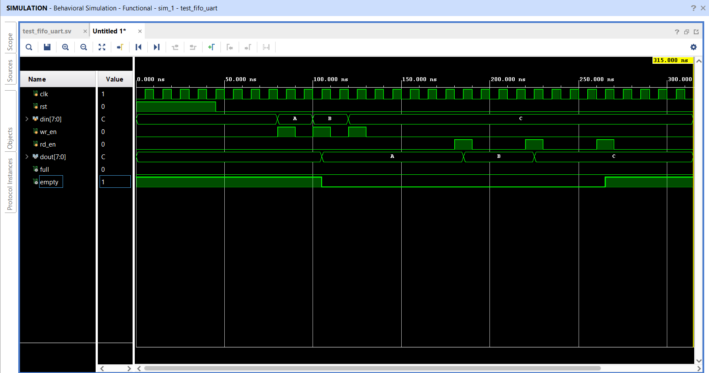
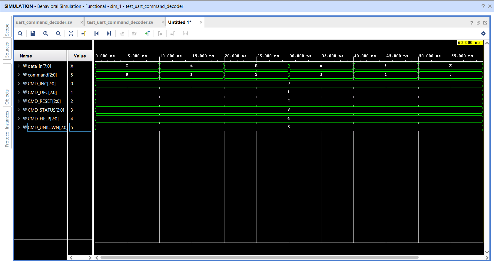
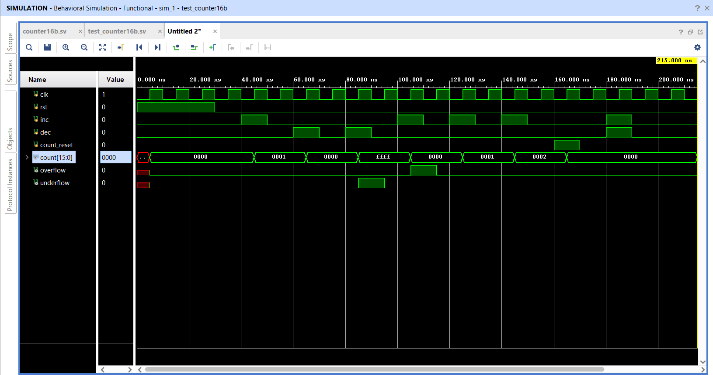
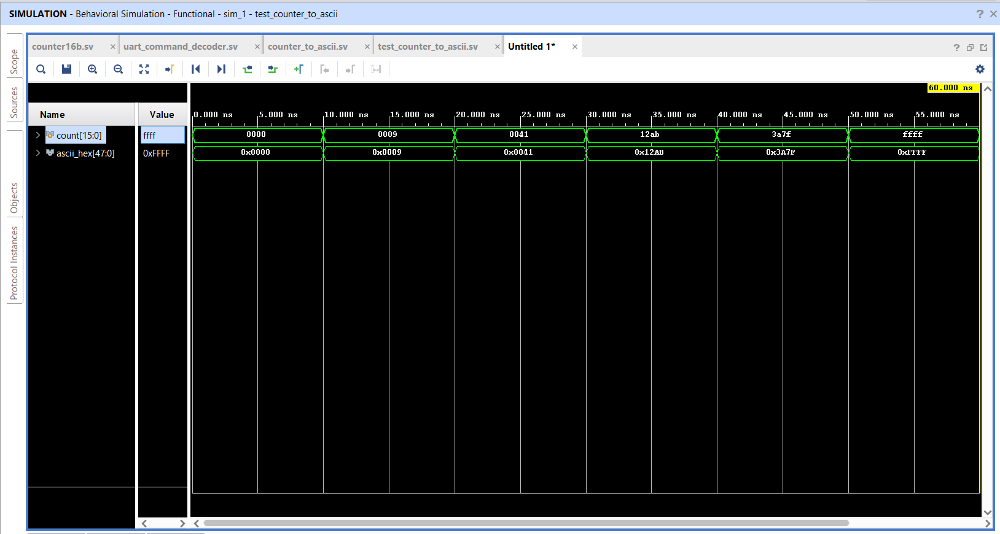
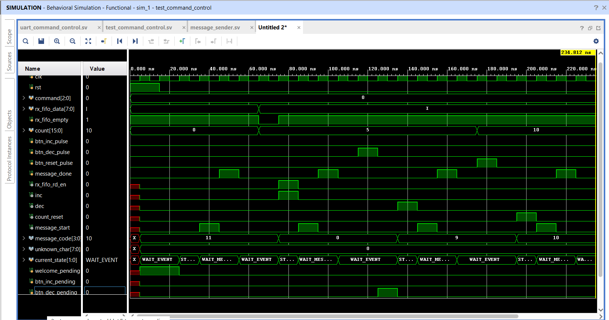
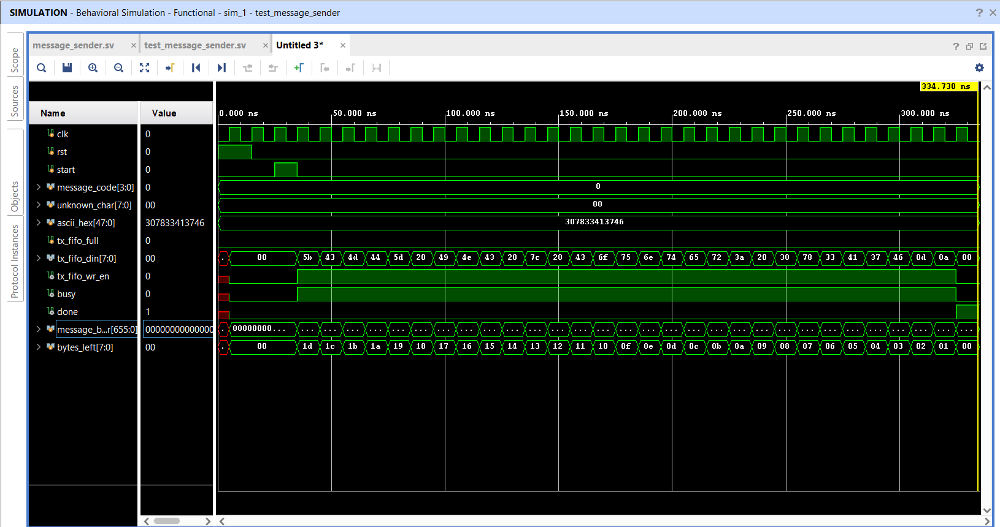
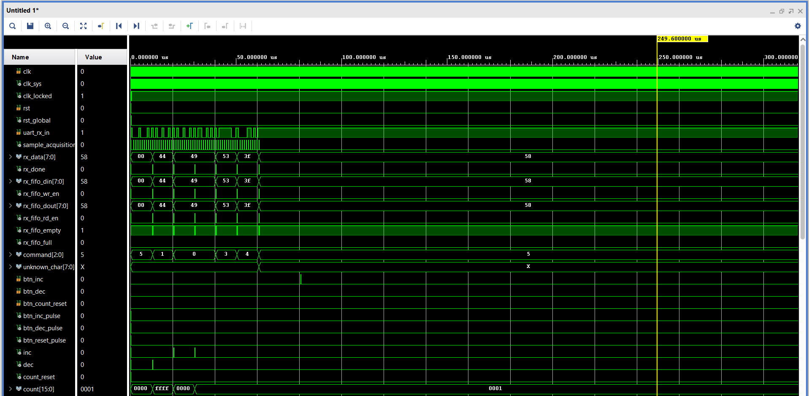
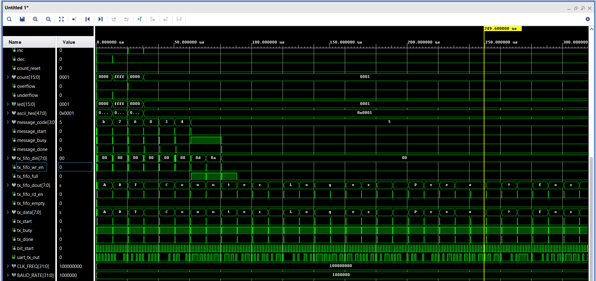

# Proiect_FPGA-UART
Implementare UART TX/RX pe placa Nexys A7, verificata prin simulare si extinsa cu loopback si logger interactiv cu contor binar.

## Etapa 1 — UART Loopback (TX + RX) - Cerinta:
În această etapă implementați și verificați modulele UART de bază. Scopul este să demonstrați că tot ce trimiteți din PuTTY vă vine înapoi corect pe același terminal (loopback hardware):
PuTTY → recepție UART → (fără procesare) → transmisie UART → PuTTY.

## Rezolvare:
Ca sursa de inspiratie am folosit videoclipurile din cursul ECE4305, modulul M8, dar si exemplul de implementare UART prezentat pe site-ul Nandland. Am gandit sistemul astfel incat fiecare parte sa fie realizata separat si verificata mai intai in simulare, iar dupa aceea modulele sa fie legate impreuna pentru realizarea loopback-ului.

Sistemul a fost impartit astfel:

- un modul uart_tx pentru transmiterea datelor;
- un modul uart_rx pentru receptionarea datelor;
- cate un testbench pentru verificarea fiecarui modul;
- un modul top_uart pentru conectarea receptorului cu transmitatorul.

Datele primite de la calculator sunt trimise direct inapoi, fara sa fie modificate:

PuTTY -> uart_rx -> uart_tx -> PuTTY

Pentru inceput, am ales comunicatia la 9600 baud, cu 8 biti de date, fara paritate si cu un bit de stop.

## Modificarea metodei de temporizare

In prima varianta am folosit un modul separat baud_rate_generator, care genera un semnal tick de 16 ori pentru fiecare bit UART. Frecventa acestuia era calculata folosind relatia:

CLKS_PER_TICK = CLK_FREQ / (BAUD_RATE * 16)

Ulterior am renuntat la acest modul si am mutat temporizarea direct in uart_rx si uart_tx.

Noua metoda calculeaza direct numarul de cicluri de clock corespunzator unui bit:

CLKS_PER_BIT = CLK_FREQ / BAUD_RATE

Am ales aceasta varianta deoarece receptorul isi poate porni contorul exact in momentul in care detecteaza bitul de start. Astfel, bitul de start este verificat dupa jumatate de perioada, iar bitii de date sunt achizitionati exact la mijlocul lor.

In plus, modulele pot fi parametrizate mai usor prin valorile CLK_FREQ si BAUD_RATE, fara sa mai fie necesara modificarea manuala a limitei unui generator separat.

## Receptorul UART

Modulul uart_rx are rolul de a receptiona datele trimise serial de la calculator si de a reconstrui caracterul primit pe 8 biti.

Modulul este parametrizat prin:

- CLK_FREQ - frecventa clock-ului folosit de placa;
- BAUD_RATE - viteza comunicatiei UART.

Durata unui bit este calculata automat cu relatia:

CLKS_PER_BIT = CLK_FREQ / BAUD_RATE

Pentru un clock de 100 MHz si un baud rate de 9600 rezulta aproximativ 10416 cicluri de clock pentru fiecare bit. In acest fel, baud rate-ul poate fi schimbat direct din parametrii modulului, fara modificarea manuala a contorului.

Intrarea rx_in vine de la calculator si nu este sincronizata cu clock-ul FPGA-ului. Din acest motiv, semnalul este trecut prin doua registre, rx_meta si rx_sync, iar masina de stari foloseste doar semnalul sincronizat rx_sync.

Receptia este realizata cu ajutorul unui FSM format din patru stari:

- RX_IDLE - asteapta aparitia bitului de start;
- RX_START - asteapta jumatate din durata unui bit si verifica daca linia este in continuare pe 0;
- RX_DATA - receptioneaza cei 8 biti de date, incepand cu bitul cel mai putin semnificativ;
- RX_STOP - verifica daca bitul de stop are valoarea 1 si valideaza caracterul primit.

Validarea bitului de start dupa jumatate de perioada ajuta la evitarea unor detectii false. Dupa aceea, fiecare bit de date este citit la interval de o perioada completa, astfel incat achizitia sa se faca aproximativ la mijlocul fiecarui bit.

Semnalul sample_acquisition devine 1 pentru un singur ciclu de clock atunci cand receptorul verifica sau citeste un bit. Pentru un cadru complet apar 10 impulsuri:

- unul pentru bitul de start;
- opt pentru bitii de date;
- unul pentru bitul de stop.

Dupa receptionarea corecta a bitului de stop, continutul registrului intern este copiat in rx_data, iar rx_done devine 1 pentru un singur ciclu de clock.

- [Codul modulului uart_rx](src/uart_rx.sv)

### Simularea receptorului

Pentru verificarea modulului am transmis caracterul A, care are valoarea 8'h41.

In testbench, semnalul uart_segment delimiteaza bitul de start, bitii D0-D7 si bitul de stop.

Acest semnal ajuta la vizualizarea bitilor care au aceeasi valoare si intre care nu apare o tranzitie pe rx_in.

In simulare se observa ca impulsurile sample_acquisition apar aproximativ la mijlocul fiecarui segment, iar FSM-ul parcurge starile:

RX_IDLE -> RX_START -> RX_DATA -> RX_STOP -> RX_IDLE

Semnalul bit_index numara bitii de la 0 la 7, iar data_reg este completat treptat cu valorile receptionate. La final, rx_data devine 8'h41, iar impulsul rx_done confirma ca receptia caracterului s-a terminat corect.

- [Testbench pentru uart_rx](sim/test_uart_rx.sv)

## Transmitatorul UART

Modulul uart_tx are rolul de a transforma un caracter primit pe 8 biti intr-un semnal serial UART, care poate fi transmis catre calculator.

La fel ca receptorul, modulul este parametrizat prin:

- CLK_FREQ - frecventa clock-ului folosit de placa;
- BAUD_RATE - viteza comunicatiei UART.

Durata unui bit este calculata cu relatia:

CLKS_PER_BIT = CLK_FREQ / BAUD_RATE

Pentru un clock de 100 MHz si un baud rate de 9600 rezulta aproximativ 10416 cicluri de clock pentru fiecare bit. Astfel, valoarea baud rate-ului poate fi schimbata direct din parametrii modulului.

Transmisia este realizata cu ajutorul unui FSM format din patru stari:

- TX_IDLE - asteapta aparitia semnalului tx_start, iar linia tx_out este mentinuta pe 1;
- TX_START - transmite bitul de start, cu valoarea 0;
- TX_DATA - transmite cei 8 biti din data_reg, incepand cu bitul cel mai putin semnificativ;
- TX_STOP - transmite bitul de stop, cu valoarea 1, apoi revine in starea de repaus.

Cand tx_start devine 1, valoarea de pe tx_data este salvata in registrul intern data_reg. Acest lucru permite transmiterea caracterului fara ca eventualele modificari ulterioare ale intrarii tx_data sa afecteze cadrul deja inceput.

Fiecare bit este mentinut pe iesirea tx_out timp de CLKS_PER_BIT cicluri. Semnalul bit_start genereaza un impuls la inceputul fiecarui bit transmis, iar bit_index indica bitul de date curent.

Semnalul tx_busy ramane activ pe toata durata transmisiei, iar tx_done devine 1 pentru un singur ciclu de clock dupa terminarea bitului de stop.

- [Codul modulului uart_tx](src/uart_tx.sv)

### Simularea transmitatorului

Pentru verificare a fost transmis caracterul A, care are valoarea: A = 8'h41 = 0100_0001

Deoarece UART transmite bitul cel mai putin semnificativ primul, ordinea bitilor pe iesirea seriala este:

D0...D7 = 1 0 0 0 0 0 1 0

In simulare se observa trecerea FSM-ului prin starile:

TX_IDLE -> TX_START -> TX_DATA -> TX_STOP -> TX_IDLE

Semnalul bit_start marcheaza inceputul fiecarui bit, iar bit_index numara bitii de date de la 0 la 7. Pe iesirea tx_out apare cadrul serial corespunzator caracterului 8'h41.

La finalul transmisiei, tx_done genereaza un impuls, iar tx_out revine pe 1, care reprezinta starea de repaus a liniei UART.

- [Testbench pentru uart_tx](sim/test_uart_tx.sv)

## Modulul de top si realizarea loopback-ului

Modulul top_uart are rolul de a conecta receptorul uart_rx cu transmitatorul uart_tx si de a realiza comunicatia de tip loopback.

La fel ca modulele RX si TX, modulul de top este parametrizat prin:

- CLK_FREQ - frecventa clock-ului sistemului;
- BAUD_RATE - viteza comunicatiei UART.

Acesti parametri sunt transmisi mai departe catre receptor si transmitator, astfel incat ambele module sa foloseasca aceeasi frecventa si acelasi baud rate.

Clock-ul placii este conectat la modulul clk_wiz_uart, care genereaza semnalul intern clk_sys. Semnalul clk_locked indica faptul ca iesirea Clocking Wizard-ului este stabila.

Resetul general este obtinut prin relatia: rst_global = btn_rst | !clk_locked.

Astfel, sistemul ramane in reset atunci cand butonul este apasat sau cat timp clock-ul intern nu este stabil.

Realizarea loopback-ului se face prin conectarea directa a receptorului cu transmitatorul:

rx_data -> tx_data
rx_done -> tx_start

Cand uart_rx termina receptionarea unui caracter, acesta pune valoarea pe rx_data si genereaza un impuls pe rx_done. Impulsul porneste transmitatorul, care trimite inapoi acelasi caracter prin iesirea uart_tx.

Fluxul complet este:

PuTTY -> uart_rx -> rx_data -> uart_tx -> PuTTY

- [Codul modulului top_uart](src/top_uart.sv)

### Simularea loopback-ului

Pentru verificarea sistemului complet a fost transmis caracterul A = 8'h41.

Testbench-ul genereaza cadrul UART pe intrarea uart_rx, iar semnalul uart_segment delimiteaza bitul de start, bitii D0-D7 si bitul de stop.

Impulsurile sample_acquisition arata momentele in care receptorul citeste fiecare bit. Dupa terminarea receptiei, rx_data devine 8'h41, iar rx_done porneste automat transmitatorul.

Pe iesirea uart_tx apare apoi acelasi cadru UART. Semnalul bit_start marcheaza inceputul fiecarui bit transmis, tx_busy arata ca transmisia este in desfasurare, iar tx_done confirma terminarea acesteia.

Simularea confirma functionarea intregului traseu:

uart_rx -> receptie 8'h41 -> pornire uart_tx -> retransmitere 8'h41

- [Testbench pentru top_uart](sim/test_top_uart.sv)

## Testarea pe placa

Dupa verificarea in simulare, am adaugat fisierul de constrangeri pentru clock, reset si interfata USB-UART.

Configurarea folosita in PuTTY a fost:

- baud rate: 9600;
- 8 biti de date;
- un bit de stop;
- fara paritate;
- fara control al fluxului;
- local echo dezactivat.

Am programat placa si am trimis mai multe caractere din PuTTY. Caracterele au fost receptionate si trimise inapoi corect.

Pentru verificare, am tinut resetul activ si am observat ca textul nu se mai afisa in PuTTY. Dupa eliberarea resetului, caracterele au inceput din nou sa fie receptionate si retransmise.

Acest test confirma ca textul afisat in terminal este cel trimis inapoi de placa, iar loopback-ul hardware functioneaza corect.

- [Fisierul de constrangeri](constraints/top_uart.xdc)

## Probleme intampinate si rezolvari

In prima varianta am folosit un modul separat baud_rate_generator, care genera 16 impulsuri tick pentru fiecare bit UART.

Numarul de cicluri dintre doua impulsuri era calculat cu relatia:

CLKS_PER_TICK = CLK_FREQ / (BAUD_RATE * 16)

Receptorul astepta 8 impulsuri pentru validarea bitului de start si apoi cate 16 impulsuri pentru fiecare bit de date.

Varianta aceasta a functionat in PuTTY deoarece cei 16 pasi de temporizare pe bit au fost suficienti pentru ca receptorul sa citeasca datele intr-o zona stabila. Chiar daca momentul achizitiei nu era exact in centrul bitului, abaterea era mica si nu afecta comunicatia.

Problema era ca generatorul functiona continuu si nu isi reseta numararea exact la detectarea bitului de start. Din acest motiv, impulsul de achizitie putea fi deplasat putin fata de mijlocul ideal al bitului. Comunicatia functiona pe placa, dar in waveform impulsurile nu apareau mereu exact in centrul segmentelor.

In plus, in primele testbench-uri am folosit tick = 1 pentru a scurta simularea. Aceasta metoda verifica succesiunea starilor, dar nu reproducea temporizarea reala de 9600 baud, motiv pentru care waveform-ul nu era foarte reprezentativ.

Pentru rezolvare am eliminat generatorul separat si am mutat temporizarea direct in modulele uart_rx si uart_tx, noua relatie folosita fiind:

CLKS_PER_BIT = CLK_FREQ / BAUD_RATE

La receptie, contorul porneste atunci cand este detectat bitul de start. Acesta asteapta CLKS_PER_BIT / 2 pentru validarea startului, apoi cate CLKS_PER_BIT cicluri pentru fiecare bit de date si pentru bitul de stop.

La transmisie, fiecare bit este mentinut pe iesire timp de CLKS_PER_BIT cicluri.

Am adaugat si semnalele sample_acquisition, bit_start si uart_segment, pentru ca momentele de receptie si limitele fiecarui bit sa fie mai usor de urmarit in simulare.

Noua implementare a facut temporizarea mai clara in waveform si permite schimbarea baud rate-ului direct prin parametrii CLK_FREQ si BAUD_RATE.

## Etapa 2 — Logger interactiv cu counter binar - Cerinta:
Porniți de la Etapa 1 funcțională și integrați counter-ul binar din proiectul anterior. FPGA-ul devine un dispozitiv care raportează pe terminal tot ce face și acceptă comenzi de la tastatură. Pe lângă comunicația cu PC-ul, apăsarea butoanelor fizice trebuie de asemenea raportată automat pe terminal.

Pe lângă comenzile primite de la PC, la fiecare apăsare a unui buton fizic FPGA-ul trebuie să trimită automat, fără intervenție de la PC, un mesaj corespunzător evenimentului: apăsare buton de incrementare, decrementare, reset, precum și cazurile de overflow / underflow ale counter-ului — alegeți un format de mesaj consistent și documentat, similar ca stil cu răspunsurile din tabelul de comenzi. La pornirea sistemului (după reset inițial), FPGA-ul trebuie să trimită automat un mesaj de bun venit și o indicație scurtă că '?' afișează meniul de ajutor; formatarea exactă a meniului rămâne la alegerea voastră, atât timp cât este clară și consistentă cu restul mesajelor.

## Rezolvare: 
Pentru proiectarea Etapei 2 am pornit de la comunicatia UART realizata anterior si am urmarit sa obtinem un sistem care sa poata primi comenzi din terminal, sa modifice un counter pe 16 biti si sa raporteze inapoi fiecare actiune facuta.

Am ales sa folosesc doua FIFO-uri, unul pentru comenzile primite si unul pentru mesajele transmise, astfel incat datele sa nu se piarda atunci cand sistemul este ocupat. Comenzile sunt interpretate separat, iar valoarea counter-ului este transformata in formatul 0xXXXX pentru a putea fi afisata usor in terminal.

Pentru butoane am reutilizat modulele de sincronizare, debounce si detectare de front, astfel incat o apasare sa produca o singura comanda. Am avut in vedere si cazurile de overflow, underflow, comenzile necunoscute, mesajul de bun venit si meniul de ajutor.

## Adaugarea FIFO-urilor si decodarea comenzilor UART

Pentru gestionarea datelor primite si transmise am adaugat doua FIFO-uri pe 8 biti, unul pentru receptie si unul pentru transmisie.

RX FIFO are rolul de a pastra caracterele primite de modulul uart_rx pana cand acestea pot fi procesate. Am ales aceasta varianta pentru ca o comanda noua sa nu se piarda atunci cand sistemul este ocupat cu generarea sau transmiterea unui mesaj.

TX FIFO pastreaza caracterele generate de modulul message_sender pana cand transmitatorul uart_tx este disponibil. Astfel, mesajele pot fi generate rapid, iar uart_tx le transmite ulterior byte cu byte, in functie de baud rate.

Am configurat FIFO-ul cu interfata Native, clock comun pentru scriere si citire, latimea datelor de 8 biti si modul First Word Fall Through. Am folosit acelasi IP de doua ori, o data pentru RX FIFO si o data pentru TX FIFO.

Am realizat si modulul uart_command_decoder, care primeste caracterul de la iesirea RX FIFO si il transforma intr-un cod de comanda folosit ulterior de modulul de control.

Comenzile recunoscute sunt:

- I/i - incrementare;
- D/d - decrementare;
- R/r - reset;
- S/s - afisarea valorii curente;
- ? - afisarea meniului de ajutor.

Pentru orice alt caracter, modulul genereaza comanda CMD_UNKNOWN.

- [Codul modulului uart_command_decoder](src/uart_command_decoder.sv)

### Simularea FIFO-ului

Pentru verificarea FIFO-ului am scris succesiv caracterele A, B si C si am urmarit iesirea, semnalele de scriere si citire, precum si starile empty si full.

Deoarece FIFO-ul functioneaza in modul First Word Fall Through, primul caracter scris apare direct pe iesire atunci cand FIFO-ul nu mai este gol. La fiecare activare a semnalului rd_en este eliminat caracterul curent si apare urmatorul.

Simularea a confirmat ca datele sunt pastrate si citite in ordinea in care au fost introduse.

- [Testbench pentru FIFO](sim/test_fifo_uart.sv)

### Simularea decodorului de comenzi

Pentru verificarea modulului uart_command_decoder am aplicat pe rand comenzile I, i, D, d, R, r, S, s si ?. Am testat si un caracter care nu face parte din lista comenzilor acceptate.

In simulare am observat ca fiecare caracter valid este transformat in codul de comanda corespunzator, iar pentru caracterul necunoscut este generat CMD_UNKNOWN.

- [Testbench pentru uart_command_decoder](sim/test_uart_command_decoder.sv)

## Integrarea counter-ului si conversia valorii in format ASCII

Am reutilizat counter-ul pe 16 biti realizat in proiectul anterior si l-am adaptat pentru comenzile primite din terminal si pentru butoanele fizice.

Modulul poate realiza trei operatii:

- incrementare prin semnalul inc;
- decrementare prin semnalul dec;
- resetarea valorii prin semnalul count_reset.

Valoarea counter-ului este pastrata pe 16 biti, intre 0x0000 si 0xFFFF. Am tratat separat si cazurile limita. Daca valoarea 0xFFFF este incrementata, counter-ul revine la 0x0000 si este activat semnalul overflow. Daca valoarea 0x0000 este decrementata, counter-ul trece la 0xFFFF si este activat semnalul underflow.

Semnalele overflow si underflow sunt impulsuri de un singur ciclu de clock si sunt folosite ulterior pentru alegerea mesajului de avertizare transmis catre terminal.

Valoarea counter-ului este conectata si la cele 16 LED-uri ale placii, astfel incat aceasta poate fi urmarita si in format binar.

- [Codul modulului counter16b](src/counter16b.sv)

### Simularea counter-ului

Pentru verificarea modulului am testat incrementarea, decrementarea, resetarea si activarea simultana a semnalelor inc si dec.

Am verificat si cazurile de overflow si underflow. La incrementarea valorii 0xFFFF, counter-ul a revenit la 0x0000 si semnalul overflow a fost activ pentru un singur ciclu. La decrementarea valorii 0x0000, counter-ul a trecut la 0xFFFF si a fost generat impulsul underflow.

Simularea a confirmat ca modulul executa corect toate operatiile si ca resetul are prioritate fata de incrementare si decrementare.

- [Testbench pentru counter16b](sim/test_counter16b.sv)

## Conversia valorii counter-ului in format ASCII

Pentru afisarea valorii in terminal am realizat modulul counter_to_ascii. Acesta transforma valoarea binara pe 16 biti intr-un sir format din sase caractere ASCII, in formatul: 0xXXXX

Cei 16 biti ai counter-ului sunt impartiti in patru grupe de cate 4 biti. Fiecare grupa reprezinta o cifra hexazecimala si este transformata in caracterul ASCII corespunzator.

Pentru valorile de la 0 la 9 sunt generate caracterele ASCII 0-9, iar pentru valorile de la 10 la 15 sunt generate caracterele A-F. Literele sunt afisate cu majuscule, conform cerintei.

De exemplu, pentru valoarea: count = 16'h3A7F modulul genereaza sirul: 0x3A7F

Iesirea are 48 de biti, deoarece contine sase caractere, fiecare reprezentat pe 8 biti.

- [Codul modulului counter_to_ascii](src/counter_to_ascii.sv)

### Simularea conversiei ASCII

Pentru verificarea modulului am aplicat valorile 0x0000, 0x0009, 0x000A, 0x12AB, 0x3A7F si 0xFFFF.

In simulare am urmarit intrarea count in format hexazecimal si iesirea ascii_hex in format ASCII. Pentru fiecare valoare, modulul a generat corect sirul 0xXXXX, inclusiv cifrele hexazecimale A-F scrise cu majuscule.

- [Testbench pentru counter_to_ascii](sim/test_counter_to_ascii.sv)

## Controlul comenzilor si generarea mesajelor UART

Pentru coordonarea comenzilor primite am realizat modulul uart_command_control. Acesta primeste codul generat de uart_command_decoder si decide ce operatie trebuie efectuata asupra counter-ului.

In functie de comanda primita, modulul genereaza un impuls pentru unul dintre semnalele:

- inc - incrementarea counter-ului;
- dec - decrementarea counter-ului;
- count_reset - resetarea counter-ului.

Pentru comenzile de status si help, valoarea counter-ului nu este modificata, fiind solicitata doar transmiterea mesajului corespunzator.

Am inclus in acelasi modul si gestionarea butoanelor fizice. Impulsurile btn_inc_pulse, btn_dec_pulse si btn_reset_pulse sunt interpretate ca evenimente separate fata de comenzile primite din terminal.

Daca un buton este apasat in timp ce un mesaj este deja in curs, evenimentul este memorat printr-un semnal pending si este procesat dupa finalizarea mesajului curent.

Modulul trateaza si cazurile limita ale counter-ului:

- incrementarea valorii 0xFFFF genereaza mesajul de overflow;
- decrementarea valorii 0x0000 genereaza mesajul de underflow.

Pentru fiecare actiune este generat un cod message_code, care indica modulului message_sender ce mesaj trebuie transmis.

La pornirea sistemului, dupa reset, este generat automat codul MSG_WELCOME. Astfel, primul mesaj transmis este mesajul de bun venit si indicatia ca tasta ? afiseaza meniul de ajutor.

Modulul foloseste o masina de stari cu trei stari:

- WAIT_EVENT - asteapta o comanda UART sau o apasare de buton;
- START_MESSAGE - genereaza impulsul message_start;
- WAIT_MESSAGE - asteapta semnalul message_done.

- [Codul modulului uart_command_control](src/uart_command_control.sv)

### Simularea modulului de control

Pentru verificarea modulului am testat mai intai generarea automata a mesajului de bun venit dupa reset.

Am testat apoi comanda UART I, apasarea butonului de decrementare si apasarea butonului de reset. In simulare am urmarit impulsurile inc, dec si count_reset, precum si codul mesajului selectat pentru fiecare eveniment.

Am observat ca message_start este activ pentru un singur ciclu de clock, iar modulul asteapta semnalul message_done inainte de a procesa urmatoarea cerere.

Simularea a confirmat functionarea corecta a masinii de stari si alegerea mesajului potrivit pentru fiecare comanda.

- [Testbench pentru uart_command_control](sim/test_command_control.sv)

## Generarea mesajelor pentru terminal

Pentru transmiterea raspunsurilor am realizat modulul message_sender. Acesta primeste message_code, valoarea counter-ului deja convertita in format ASCII si caracterul necunoscut, atunci cand este cazul.

In functie de message_code, modulul selecteaza mesajul care trebuie transmis. Am folosit formatele prezentate in fisierul pdf:

[CMD] INC | Counter: 0x0001
[BTN] DEC | Counter: 0x0000
[STATUS] Counter: 0x000A
[WARN] Overflow | Counter: 0x0000
[ERR] Unknown: 'X'

Am adaugat si mesajul de bun venit:

UART Counter Logger
Press ? for help

Mesajul selectat este incarcat intr-un registru intern, iar caracterele sunt trimise pe rand catre TX FIFO.

Iesirea tx_fifo_din contine caracterul curent, iar tx_fifo_wr_en este activ doar atunci cand modulul transmite si TX FIFO nu este plin.

Daca tx_fifo_full devine 1, transmiterea este oprita temporar. Caracterul curent ramane pastrat, iar trimiterea continua dupa ce apare din nou spatiu liber in FIFO.

Semnalul busy ramane activ pe durata generarii mesajului, iar done devine 1 pentru un singur ciclu dupa introducerea ultimului caracter in TX FIFO.

O cerere noua primita in timp ce busy este activ nu modifica mesajul curent. Comenzile UART raman in RX FIFO, iar evenimentele butoanelor sunt memorate de modulul de control si sunt procesate ulterior.

- [Codul modulului message_sender](src/message_sender.sv)

### Simularea generatorului de mesaje

Pentru verificare am selectat mesajul MSG_INC si valoarea counter-ului 0x3A7F.

In simulare am observat pe tx_fifo_din urmatoarea succesiune de caractere:

[CMD] INC | Counter: 0x3A7F

La final au fost transmise caracterele CR si LF, folosite pentru trecerea pe rand nou in terminal.

Semnalul tx_fifo_wr_en a ramas activ pentru fiecare caracter valid, busy a fost activ pe toata durata mesajului, iar done a generat un singur impuls dupa ultimul caracter.

Simularea a confirmat transmiterea corecta a mesajului byte cu byte si oprirea temporara atunci cand FIFO-ul nu este disponibil.

- [Testbench pentru message_sender](sim/test_message_sender.sv)

## Integrarea modulelor in top si simularea sistemului complet

Pentru conectarea tuturor modulelor am realizat modulul top_uart_logger. In acest modul am legat receptia UART, cele doua FIFO-uri, decodorul de comenzi, modulul de control, counter-ul, convertorul binar-ASCII, generatorul de mesaje si transmitatorul UART.

Fluxul comenzilor primite din terminal este:

PuTTY -> uart_rx -> RX FIFO -> uart_command_decoder -> uart_command_control

Modulul uart_command_control genereaza semnalele inc, dec si count_reset, care controleaza counter-ul pe 16 biti. Valoarea counter-ului este trimisa catre cele 16 LED-uri si catre modulul counter_to_ascii.

Fluxul mesajelor transmise este:

counter_to_ascii -> message_sender -> TX FIFO -> uart_tx -> PuTTY

Am conectat TX FIFO la uart_tx astfel incat un caracter sa fie citit numai atunci cand FIFO-ul nu este gol si transmitatorul UART nu este ocupat.

Pentru cele trei butoane am folosit separat lantul:

button_sync -> debouncer -> edge_detector

Astfel, fiecare apasare este sincronizata, filtrata si transformata intr-un impuls de un singur ciclu de clock.

Am folosit modulul clk_wiz_uart pentru generarea clock-ului intern clk_sys. Resetul general este obtinut din butonul de reset si semnalul locked al Clocking Wizard-ului:

rst_global = rst | !clk_locked

In acest mod, toate modulele raman in reset pana cand clock-ul intern devine stabil.

Butonul de reset al counter-ului este separat de resetul general. Astfel, apasarea acestuia reseteaza doar valoarea counter-ului si permite transmiterea mesajului corespunzator, fara sa reseteze intregul sistem.

- [Codul modulului top_uart_logger](src/top_uart_logger.sv)

### Simularea sistemului complet

Pentru verificarea integrarii am realizat testbench-ul test_top_uart_logger.

In simulare am folosit un baud rate mai mare decat cel utilizat pe placa, pentru a reduce timpul necesar transmiterii mesajelor. Aceasta modificare afecteaza doar viteza simularii, nu si functionarea modulelor.

Am verificat urmatoarele situatii:

- transmiterea automata a mesajului de bun venit dupa reset;
- decrementarea valorii 0x0000 si aparitia underflow-ului;
- incrementarea valorii 0xFFFF si aparitia overflow-ului;
- incrementarea normala a counter-ului;
- comanda de status;
- comanda pentru meniul de ajutor;
- primirea unui caracter necunoscut;
- apasarea butoanelor de incrementare, decrementare si reset.

Pentru comenzile UART am folosit un task care genereaza bitul de start, cei 8 biti de date si bitul de stop.

In waveform am urmarit receptia caracterelor, comenzile decodate, semnalele de control ale counter-ului, valoarea afisata pe LED-uri, codurile mesajelor si transferul caracterelor prin TX FIFO catre uart_tx.

Simularea a confirmat functionarea traseului complet:

receptie comanda -> procesare -> modificare counter -> generare mesaj -> transmisie UART

- [Testbench pentru top_uart_logger](sim/test_top_uart_logger.sv)

## Adaugarea fisierului de constrangeri si testarea pe placa

Pentru implementarea proiectului pe placa Nexys A7-100T am actualizat fisierul de constrangeri astfel incat toate porturile modulului top_uart_logger sa fie conectate la resursele fizice corespunzatoare.

Am conectat clock-ul principal al placii, cu frecventa de 100 MHz, la intrarea clk. Pentru resetul general am folosit butonul central BTNC.

Butoanele counter-ului au fost configurate astfel:

- BTNR - incrementarea counter-ului;
- BTNL - decrementarea counter-ului;
- BTND - resetarea counter-ului;
- BTNC - resetarea generala a sistemului.

Valoarea counter-ului este conectata la cele 16 LED-uri ale placii. Fiecare LED reprezinta cate un bit al valorii count, LED0 fiind bitul cel mai putin semnificativ, iar LED15 bitul cel mai semnificativ.

Pentru comunicatia cu terminalul am folosit interfata USB-UART integrata pe placa:

- uart_rx_in primeste datele transmise de calculator;
- uart_tx_out transmite mesajele generate de FPGA catre calculator.

Am configurat terminalul serial cu urmatorii parametri:

- baud rate: 9600;
- data bits: 8;
- stop bits: 1;
- parity: None;
- flow control: None;
- local echo: Off.

Spre deosebire de simulare, unde am folosit un baud rate mai mare pentru reducerea timpului de executie, pe placa am utilizat valoarea reala de 9600 baud.

- [Fisierul de constrangeri](constraints/top_uart.xdc)

### Testarea comunicatiei pe placa

Dupa generarea bitstream-ului am programat placa si am deschis terminalul serial corespunzator interfetei USB-UART.

La apasarea butonului central de reset, sistemul transmite automat mesajul de pornire:

UART Counter Logger
Press ? for help

Am testat comenzile transmise din terminal:

- I si i pentru incrementare;
- D si d pentru decrementare;
- R si r pentru resetarea counter-ului;
- S si s pentru afisarea valorii curente;
- ? pentru afisarea meniului de ajutor;
- un caracter necunoscut pentru verificarea mesajului de eroare.

Pentru fiecare comanda, valoarea counter-ului a fost actualizata pe LED-uri si a fost transmis mesajul corespunzator in terminal.

Am verificat si comenzile generate de butoanele fizice. Apasarea unui buton modifica valoarea counter-ului si transmite automat un mesaj, fara sa fie necesara introducerea unei comenzi de la calculator.

Am testat si cazurile limita:

- incrementarea valorii 0xFFFF produce overflow si revenirea la 0x0000;
- decrementarea valorii 0x0000 produce underflow si trecerea la 0xFFFF.

Prin aceasta testare am verificat functionarea completa a sistemului, de la comenzile primite prin UART si apasarile butoanelor pana la actualizarea LED-urilor si transmiterea mesajelor catre terminal.

