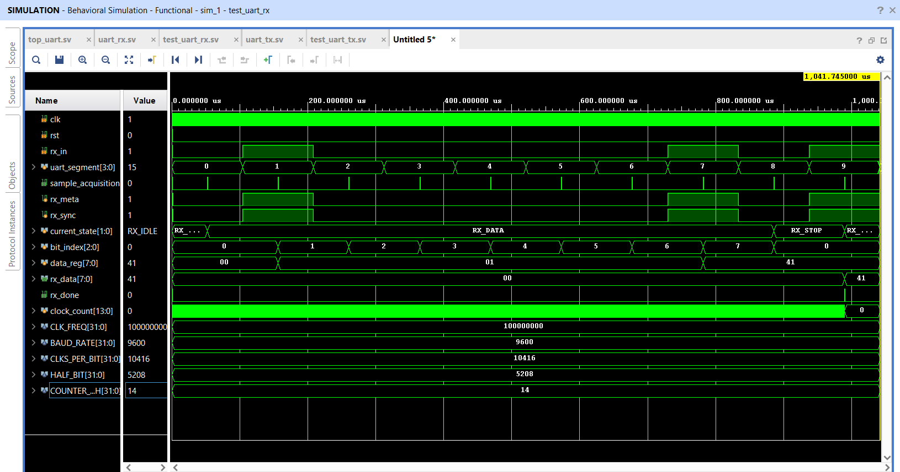
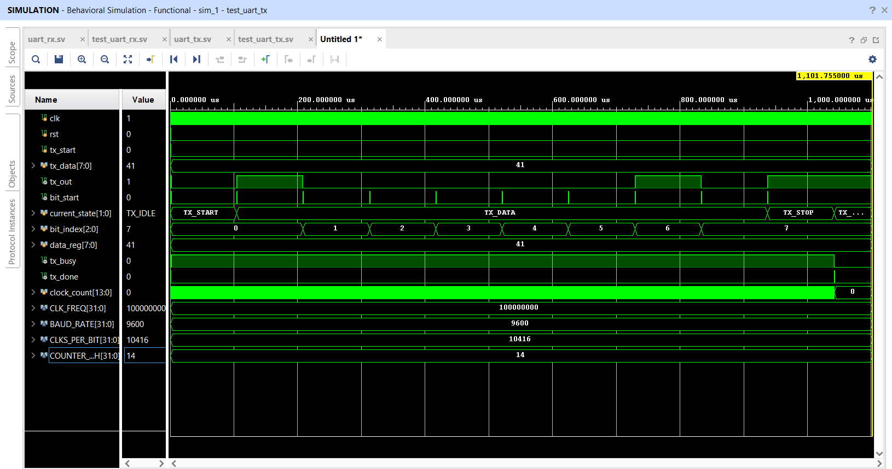
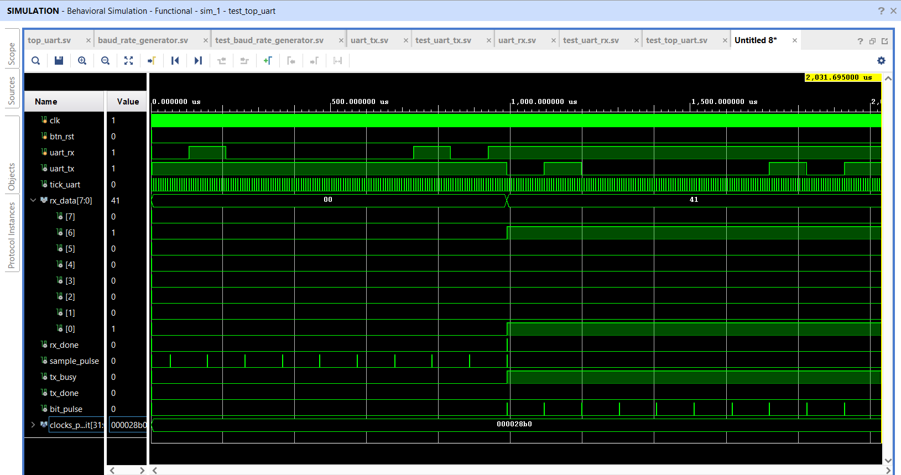

# Proiect_FPGA-UART
Implementare UART TX/RX pe placa Nexys A7, verificata prin simulare si extinsa cu loopback si logger interactiv cu contor binar.

## Etapa 1 — UART Loopback (TX + RX) - Cerinta:
În această etapă implementați și verificați modulele UART de bază. Scopul este să demonstrați că tot ce trimiteți din PuTTY vă vine înapoi corect pe același terminal (loopback hardware):
PuTTY → recepție UART → (fără procesare) → transmisie UART → PuTTY.

## Rezolvare:
Ca sursa de inspiratie am folosit videoclipurile din cursul ECE4305, modulul M8, dar si exemplul de implementare UART prezentat pe site-ul Nandland. Am gandit sistemul astfel incat fiecare parte sa fie realizata separat si verificata mai intai in simulare, iar dupa aceea modulele sa fie legate impreuna pentru realizarea loopback-ului.

Sistemul a fost impartit astfel:

- un modul uart_tx pentru transmiterea datelor;
- un modul uart_rx pentru receptionarea datelor;
- cate un testbench pentru verificarea fiecarui modul;
- un modul top_uart pentru conectarea receptorului cu transmitatorul.

Datele primite de la calculator sunt trimise direct inapoi, fara sa fie modificate:

PuTTY -> uart_rx -> uart_tx -> PuTTY

Pentru inceput, am ales comunicatia la 9600 baud, cu 8 biti de date, fara paritate si cu un bit de stop.

## Modificarea metodei de temporizare

In prima varianta am folosit un modul separat baud_rate_generator, care genera un semnal tick de 16 ori pentru fiecare bit UART. Frecventa acestuia era calculata folosind relatia:

CLKS_PER_BIT = CLK_FREQ / (BAUD_RATE * 16)

Ulterior am renuntat la acest modul si am mutat temporizarea direct in uart_rx si uart_tx.

Noua metoda calculeaza direct numarul de cicluri de clock corespunzator unui bit:

CLKS_PER_BIT = CLK_FREQ / BAUD_RATE

Am ales aceasta varianta deoarece receptorul isi poate porni contorul exact in momentul in care detecteaza bitul de start. Astfel, bitul de start este verificat dupa jumatate de perioada, iar bitii de date sunt achizitionati exact la mijlocul lor.

In plus, modulele pot fi parametrizate mai usor prin valorile CLK_FREQ si BAUD_RATE, fara sa mai fie necesara modificarea manuala a limitei unui generator separat.

## Receptorul UART

Modulul uart_rx are rolul de a receptiona datele trimise serial de la calculator si de a reconstrui caracterul primit pe 8 biti.

Modulul este parametrizat prin:

- CLK_FREQ - frecventa clock-ului folosit de placa;
- BAUD_RATE - viteza comunicatiei UART.

Durata unui bit este calculata automat cu relatia:

CLKS_PER_BIT = CLK_FREQ / BAUD_RATE

Pentru un clock de 100 MHz si un baud rate de 9600 rezulta aproximativ 10416 cicluri de clock pentru fiecare bit. In acest fel, baud rate-ul poate fi schimbat direct din parametrii modulului, fara modificarea manuala a contorului.

Intrarea rx_in vine de la calculator si nu este sincronizata cu clock-ul FPGA-ului. Din acest motiv, semnalul este trecut prin doua registre, rx_meta si rx_sync, iar masina de stari foloseste doar semnalul sincronizat rx_sync.

Receptia este realizata cu ajutorul unui FSM format din patru stari:

- RX_IDLE - asteapta aparitia bitului de start;
- RX_START - asteapta jumatate din durata unui bit si verifica daca linia este in continuare pe 0;
- RX_DATA - receptioneaza cei 8 biti de date, incepand cu bitul cel mai putin semnificativ;
- RX_STOP - verifica daca bitul de stop are valoarea 1 si valideaza caracterul primit.

Validarea bitului de start dupa jumatate de perioada ajuta la evitarea unor detectii false. Dupa aceea, fiecare bit de date este citit la interval de o perioada completa, astfel incat achizitia sa se faca aproximativ la mijlocul fiecarui bit.

Semnalul sample_acquisition devine 1 pentru un singur ciclu de clock atunci cand receptorul verifica sau citeste un bit. Pentru un cadru complet apar 10 impulsuri:

- unul pentru bitul de start;
- opt pentru bitii de date;
- unul pentru bitul de stop.

Dupa receptionarea corecta a bitului de stop, continutul registrului intern este copiat in rx_data, iar rx_done devine 1 pentru un singur ciclu de clock.

- [Codul modulului uart_rx](src/uart_rx.sv)

### Simularea receptorului

Pentru verificarea modulului am transmis caracterul A, care are valoarea 8'h41.

In testbench, semnalul uart_segment delimiteaza bitul de start, bitii D0-D7 si bitul de stop.

Acest semnal ajuta la vizualizarea bitilor care au aceeasi valoare si intre care nu apare o tranzitie pe rx_in.

In simulare se observa ca impulsurile sample_acquisition apar aproximativ la mijlocul fiecarui segment, iar FSM-ul parcurge starile:

RX_IDLE -> RX_START -> RX_DATA -> RX_STOP -> RX_IDLE

Semnalul bit_index numara bitii de la 0 la 7, iar data_reg este completat treptat cu valorile receptionate. La final, rx_data devine 8'h41, iar impulsul rx_done confirma ca receptia caracterului s-a terminat corect.

- [Testbench pentru uart_rx](sim/test_uart_rx.sv)

## Transmitatorul UART

Modulul uart_tx are rolul de a transforma un caracter primit pe 8 biti intr-un semnal serial UART, care poate fi transmis catre calculator.

La fel ca receptorul, modulul este parametrizat prin:

- CLK_FREQ - frecventa clock-ului folosit de placa;
- BAUD_RATE - viteza comunicatiei UART.

Durata unui bit este calculata cu relatia:

CLKS_PER_BIT = CLK_FREQ / BAUD_RATE

Pentru un clock de 100 MHz si un baud rate de 9600 rezulta aproximativ 10416 cicluri de clock pentru fiecare bit. Astfel, valoarea baud rate-ului poate fi schimbata direct din parametrii modulului.

Transmisia este realizata cu ajutorul unui FSM format din patru stari:

- TX_IDLE - asteapta aparitia semnalului tx_start, iar linia tx_out este mentinuta pe 1;
- TX_START - transmite bitul de start, cu valoarea 0;
- TX_DATA - transmite cei 8 biti din data_reg, incepand cu bitul cel mai putin semnificativ;
- TX_STOP - transmite bitul de stop, cu valoarea 1, apoi revine in starea de repaus.

Cand tx_start devine 1, valoarea de pe tx_data este salvata in registrul intern data_reg. Acest lucru permite transmiterea caracterului fara ca eventualele modificari ulterioare ale intrarii tx_data sa afecteze cadrul deja inceput.

Fiecare bit este mentinut pe iesirea tx_out timp de CLKS_PER_BIT cicluri. Semnalul bit_start genereaza un impuls la inceputul fiecarui bit transmis, iar bit_index indica bitul de date curent.

Semnalul tx_busy ramane activ pe toata durata transmisiei, iar tx_done devine 1 pentru un singur ciclu de clock dupa terminarea bitului de stop.

- [Codul modulului uart_tx](src/uart_tx.sv)

### Simularea transmitatorului

Pentru verificare a fost transmis caracterul A, care are valoarea: A = 8'h41 = 0100_0001

Deoarece UART transmite bitul cel mai putin semnificativ primul, ordinea bitilor pe iesirea seriala este:

D0...D7 = 1 0 0 0 0 0 1 0

In simulare se observa trecerea FSM-ului prin starile:

TX_IDLE -> TX_START -> TX_DATA -> TX_STOP -> TX_IDLE

Semnalul bit_start marcheaza inceputul fiecarui bit, iar bit_index numara bitii de date de la 0 la 7. Pe iesirea tx_out apare cadrul serial corespunzator caracterului 8'h41.

La finalul transmisiei, tx_done genereaza un impuls, iar tx_out revine pe 1, care reprezinta starea de repaus a liniei UART.

- [Testbench pentru uart_tx](sim/test_uart_tx.sv)

## Integrarea UART Loopback

Dupa verificarea separata a modulelor uart_rx si uart_tx, acestea au fost conectate in modulul top_uart.

Datele receptionate sunt trimise direct catre transmitator:

- rx_data este conectat la tx_data;
- rx_done este folosit pentru pornirea transmisiei;
- acelasi caracter primit este trimis inapoi fara modificare.

Pentru verificare am realizat testbench-ul test_top_uart, in care am trimis caracterul ASCII "A".

In simulare s-a observat ca valoarea receptionata este "8'h41", iar acelasi cadru UART este transmis inapoi pe iesirea "uart_tx".

## Testarea pe placa

Dupa verificarea in simulare, am adaugat fisierul de constrangeri pentru clock, reset si interfata USB-UART.

Configurarea folosita in PuTTY a fost:

- baud rate: 9600;
- 8 biti de date;
- un bit de stop;
- fara paritate;
- fara control al fluxului;
- local echo dezactivat.

Am programat placa si am trimis mai multe caractere din PuTTY. Caracterele au fost receptionate si trimise inapoi corect.

Pentru verificare, am tinut resetul activ si am observat ca textul nu se mai afisa in PuTTY. Dupa eliberarea resetului, caracterele au inceput din nou sa fie receptionate si retransmise.

Acest test confirma ca textul afisat in terminal este cel trimis inapoi de placa, iar loopback-ul hardware functioneaza corect.
